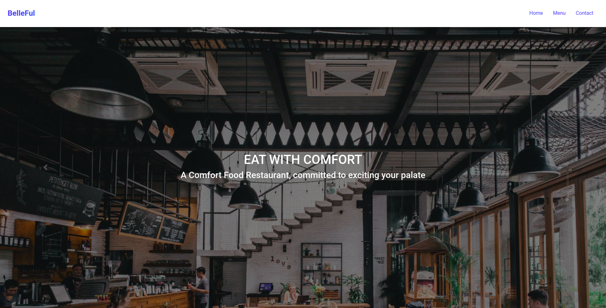

# Resturant

In this project, we built a simple and static webpage for an imaginary resturant

- DOM Manipulation with JavaScript
- Events

- [Live Demo Link](https://rawcdn.githack.com/OlawaleJoseph/Resturant/a149553fb7d8203487351c6d9b1506bf7267ef15/dist/index.html)



## Built With

- HTML
- JavaScript
- BootStrap

## Getting Started

To get a local copy of the repository please run the following commands on your terminal:

```bash
$ cd <folder>
$ git clone https://github.com/OlawaleJoseph/Resturant.git
$ cd into  the cloned repo
$ Open a terminal and 'run npm install'
$ Run the command npm run build
$ Open the dist folder in the root of the app, open the index.html file witha browser(Chrome, Firefox...)
```

## Author

👤 **Adedeko Olawale**

- Github: [@OlawaleJoseph](https://github.com/OlawaleJoseph)
- Twitter: [@javanode123](https://twitter.com/javanode123)
- Linkedin: [olawale-adedeko](http://www.linkedin.com/in/olawale-adedeko)


## 🤝 Contributing

Contributions, issues and feature requests are welcome!

Feel free to check the [issues page](https://github.com/OlawaleJoseph/Resturant/issues).

## Show your support

Give a ⭐️ if you like this project!
